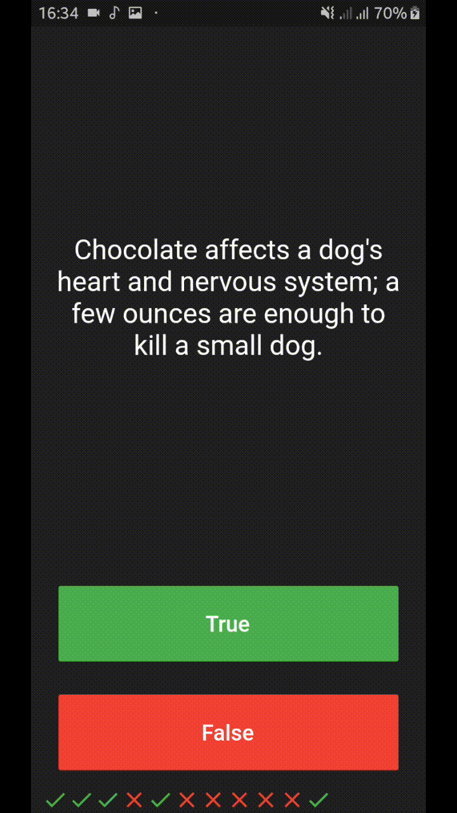

# Quizzler ❓ 
 &nbsp;&nbsp;
## My Goal In This Project

In this App i will be reviewing Stateful and Stateless Widgets as well as learning about the fundamental building blocks of Object Oriented Programming (OOP) - Classes and Objects. 

## What Is this 

Quizzler a quiz app that tests your general knowledge. As one of the most popular types of apps on the app stores!

 &nbsp;&nbsp;

 &nbsp;&nbsp;

## Stuff I Learned in This App

- Modularising your code into separate classes.
- Dart classes and objects.
- Using class constructors.
- Extracting Widgets to refactor your code.
- private and public modifiers in Dart.
- How to use Dart lists.
- The difference between var, const and final.

## TODOS
* Adding More Questions
* Making An Online Feature With More Question
* Adding SQL To Keep Track OF HighScores
